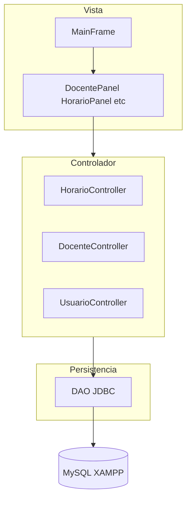

# Sistema de Gestión y Control de Horarios Docentes — UNEFA

Aplicación de escritorio en **Java 11 + Swing** con arquitectura **MVC + DAO**, motor de **detección de colisiones** (docente, aula, horas semanales por asignatura), **bitácora** y reportes **PDF/CSV** (JasperReports).

Esta guía está pensada para que **todo el equipo** pueda clonar o copiar `Proyecto_Horarios`, configurar **XAMPP + NetBeans** y ejecutar la aplicación paso a paso.

---

## Requisitos previos

| Requisito                    | Versión sugerida                | Obligatorio      |
| ---------------------------- | ------------------------------- | ---------------- |
| JDK                          | 11 o superior                   | Sí               |
| NetBeans                     | Con soporte Java / Ant          | Sí (recomendado) |
| XAMPP                        | MySQL 8 (MariaDB incluido)      | Sí               |
| MySQL Connector/J            | 8.x (`mysql-connector-j-*.jar`) | Sí               |
| JasperReports + dependencias | Ver `lib/LEEME_JASPER.txt`      | Solo para PDF    |

> **Importante:** La aplicación **requiere MySQL**. Si no hay conexión, no abre el login y muestra un mensaje con los pasos a seguir. No hay modo memoria ni datos demo automáticos.

---

## Guía rápida de instalación (checklist)

Marquen cada paso antes de la demo o la entrega:

- [ ] XAMPP instalado → **MySQL** en **Start** (verde)
- [ ] Importado `database/db_horarios_unefa.sql` en phpMyAdmin
- [ ] Carpeta `Proyecto_Horarios` abierta en NetBeans
- [ ] `mysql-connector-j.jar` en `lib/` y agregado en **Libraries**
- [ ] (PDF) JARs de Jasper en `lib/` según `lib/LEEME_JASPER.txt`
- [ ] **Clean and Build** sin errores
- [ ] **Run** → login `admin` / `12345678`
- [ ] Datos de prueba: al menos 1 docente, 1 asignatura, 1 aula, 1 horario

---

## PASO 1 — XAMPP y MySQL

1. Descargar e instalar XAMPP: https://www.apachefriends.org
2. Abrir el **Panel de control de XAMPP**.
3. Pulsar **Start** en la fila **MySQL** (debe quedar en verde).
4. **Apache no es necesario** para este proyecto.

### Si MySQL no arranca

- Cerrar otros programas que usen el puerto 3306 (otro MySQL, WAMP, etc.).
- En XAMPP: **Stop** → esperar → **Start** de nuevo.
- Reiniciar el PC si el servicio quedó bloqueado.

---

## PASO 2 — Crear la base de datos (phpMyAdmin)

### Importar el script (instalación nueva)

1. En XAMPP, clic **Admin** junto a MySQL (abre **phpMyAdmin**),  
   o navegar a: `http://localhost/phpmyadmin`
2. Pestaña **Importar** (o **SQL**).
3. **Elegir archivo** → seleccionar:

   ```
   Proyecto_Horarios/database/db_horarios_unefa.sql
   ```

4. Clic **Continuar** / **Ejecutar**.
5. Verificar en el panel izquierdo: debe existir la base **`db_horarios_unefa`**.
6. Tabla **`usuarios`**: debe haber un registro con `username = admin`.

### Si ya tenían la base de datos de una versión anterior

- **No** hace falta borrar todo.
- Al abrir la app se migran contraseñas en texto plano a hash y se reconcilian vínculos docente–usuario.
- Opcional: ejecutar solo el `UPDATE` del final del archivo `.sql` si el admin seguía con clave visible en plano.

### Credenciales de login (aplicación)

| Usuario | Clave      | Rol   |
| ------- | ---------- | ----- |
| `admin` | `12345678` | ADMIN |

En phpMyAdmin el campo `password` del admin se ve **hasheado** (formato `xxxx:yyyy`). Eso es correcto; para entrar usen la clave **`12345678`**.

---

## PASO 3 — Abrir el proyecto en NetBeans

1. Copiar o clonar la carpeta completa **`Proyecto_Horarios`** (debe contener `nbproject/`, `src/`, `build.xml`).
2. NetBeans → **File → Open Project**.
3. Seleccionar la carpeta `Proyecto_Horarios` → **Open Project**.
4. El icono debe ser una taza de café (proyecto Java Ant).

### Clase principal

Ya configurada en el proyecto:

```
com.horarios.view.MainFrame
```

Para ejecutar: clic derecho en el proyecto → **Run** (o **F6**).

### Configurar JDK (si NetBeans lo pide)

1. **Tools → Java Platforms** → agregar **JDK 11** o superior.
2. Clic derecho en el proyecto → **Properties → Libraries**.
3. En **Java Platform**, elegir ese JDK → **OK**.

---

## PASO 4 — Librerías en `lib/`

### MySQL Connector/J (obligatorio)

1. Descargar desde: https://dev.mysql.com/downloads/connector/j/
   - Tipo: **Platform Independent** → ZIP.
2. Extraer `mysql-connector-j-8.x.x.jar`.
3. Copiar a:

   ```
   Proyecto_Horarios/lib/mysql-connector-j-8.3.0.jar
   ```

   (el número de versión puede variar)

4. En NetBeans:
   - Clic derecho en el proyecto → **Properties**
   - **Libraries** → pestaña **Classpath**
   - **Add JAR/Folder** → elegir el JAR dentro de `lib/`
   - **OK**

5. Verificar en `nbproject/project.properties` una línea similar a:

   ```properties
   file.reference.mysql-connector=lib/mysql-connector-j-8.3.0.jar
   ```

### JasperReports (solo si van a generar PDF)

1. Leer **`lib/LEEME_JASPER.txt`**.
2. Opcional en Windows: ejecutar `lib/descargar_dependencias.ps1` en PowerShell.
3. Asegurarse de que los JAR listados en `nbproject/project.properties` existan físicamente en `lib/`.

---

## PASO 5 — Conexión JDBC (XAMPP por defecto)

Archivo: `src/com/horarios/util/Conexion.java`

Valores típicos de XAMPP:

```java
private final String url = "jdbc:mysql://localhost:3306/db_horarios_unefa?useSSL=false&serverTimezone=UTC";
private final String usuario = "root";
private final String clave = "";   // vacía en XAMPP por defecto
```

Si su instalación de MySQL usa contraseña en `root`, cambien solo `clave`.

`PersistenciaConfig.java` debe tener `INTENTAR_JDBC = true` (valor por defecto del proyecto).

---

## PASO 6 — Compilar y ejecutar

1. Clic derecho en el proyecto → **Clean and Build**.
2. Revisar la ventana **Output**: debe decir **BUILD SUCCESSFUL**.
3. Clic derecho → **Run**.

### Si aparece «No hay conexión a MySQL»

Revise en este orden:

1. MySQL **Start** en XAMPP.
2. Base `db_horarios_unefa` creada (Paso 2).
3. JAR del conector en `lib/` y en **Libraries**.
4. Usuario/clave en `Conexion.java`.

### Si aparece «No se encontró el Driver JDBC de MySQL»

Falta el JAR del conector en el classpath → repetir **Paso 4**.

---

## PASO 7 — Primer uso: cargar datos de prueba

Entrar como **`admin`** / **`12345678`** y seguir este orden:

| Orden | Módulo          | Qué hacer                                                                                                               |
| ----- | --------------- | ----------------------------------------------------------------------------------------------------------------------- |
| 1     | **Docentes**    | Registrar docentes (cédula **8 dígitos**). Crea usuario DOCENTE automático (username = cédula, clave inicial = cédula). |
| 2     | **Usuarios**    | Crear **ADMIN** o **COORDINADOR** si hace falta. **No** se crean DOCENTE aquí.                                          |
| 3     | **Asignaturas** | Registrar materias y horas semanales.                                                                                   |
| 4     | **Aulas**       | Registrar aulas.                                                                                                        |
| 5     | **Horarios**    | Usar la cuadrícula: celda vacía **(+)** = alta; celda con clase = consultar/modificar/eliminar.                         |

### Reglas de roles (importante para el equipo)

| Rol                            | Cómo se crea                                                          |
| ------------------------------ | --------------------------------------------------------------------- |
| **DOCENTE**                    | Solo desde **módulo Docentes**                                        |
| **ADMIN / COORDINADOR**        | Módulo **Usuarios → Registrar**                                       |
| Promover docente a coord/admin | **Usuarios → Modificar** → elegir ADMIN o COORDINADOR                 |
| Bajar de docente a catálogo    | Al cambiar rol en Usuarios, se da de baja en Docentes automáticamente |

---

## PASO 8 — Generar JAR para entrega

1. NetBeans → **Clean and Build**.
2. El archivo queda en:

   ```
   Proyecto_Horarios/dist/Proyecto_Horarios.jar
   ```

---

## Estructura del proyecto

```
Proyecto_Horarios/
├── src/com/horarios/
│   ├── model/          # Entidades POO (Docente, Horario, Usuario…)
│   ├── model/dao/      # Acceso a datos con PreparedStatement
│   ├── controller/     # Reglas de negocio y colisiones
│   ├── view/           # Swing (MainFrame, paneles, diálogos)
│   └── util/           # Conexion, Mensajes, Permisos, Reportes…
├── database/           # Script SQL único de instalación
├── Public/             # Logos (login y sidebar)
├── reports/            # Plantillas Jasper (.jrxml)
├── lib/                # JARs externos (MySQL, Jasper…)
├── nbproject/          # Configuración NetBeans
├── build.xml           # Compilación Ant
└── README.md           # Guía principal del repositorio
```

> Manual de usuario, checklist de pruebas, diagramas UML y enunciado académico no se incluyen en Git; solicítelos al coordinador del equipo.

---

## Cómo funciona el sistema

### Arquitectura



- **Vista:** no contiene SQL; solo eventos y diálogos.
- **Controlador:** valida colisiones antes de guardar horarios; sincroniza roles docente–usuario.
- **DAO:** `PreparedStatement` (mitiga inyección SQL).
- **Seguridad:** contraseñas con hash SHA-256 + salt; no se muestran en consultas.

### Roles de usuario

| Rol             | Acceso                                                               |
| --------------- | -------------------------------------------------------------------- |
| **ADMIN**       | Todo: usuarios, bitácora, CRUD completo, reportes                    |
| **COORDINADOR** | Docentes, asignaturas, aulas, horarios (edición), bitácora, reportes |
| **DOCENTE**     | Inicio, horarios (consulta), Mi perfil                               |

### Módulo de horarios

- Cuadrícula semanal: celda vacía (**+**) = registrar; celda con clase = menú consultar/modificar/eliminar.
- **Exportar CSV** y **Reportes PDF** (General, Semanal, Quincenal, Mensual).
- Motor de choques impide: mismo docente a la vez, misma aula ocupada, superar horas semanales de la asignatura.

### Bitácora

Registra login, logout, CRUD, intentos fallidos y exportaciones en la tabla `bitacora`.

---

## Reportes PDF y CSV

1. Tener los JAR de Jasper en `lib/` (ver `lib/LEEME_JASPER.txt`).
2. **PDF:** menú **Reportes PDF** o desde Horarios → tipos General / Semanal / Quincenal / Mensual.
3. **CSV:** «Exportar CSV» en Horarios; «Reporte general CSV» en Inicio (ADMIN/COORD).
4. Formato de hoja PDF: **carta** vertical (8,5″ × 11″).

---

## Problemas frecuentes

| Problema                                       | Solución                                                        |
| ---------------------------------------------- | --------------------------------------------------------------- |
| Driver JDBC no encontrado                      | JAR MySQL en `lib/` + **Properties → Libraries**                |
| No conecta a MySQL                             | XAMPP MySQL ON, script SQL ejecutado, `Conexion.java`           |
| `admin` no entra                               | Usuario `admin`, clave `12345678`                               |
| Error Aria en phpMyAdmin (pestaña Operaciones) | Si NetBeans funciona, ignorar; usar **Examinar** en tablas      |
| Logos no se ven                                | Ejecutar desde la carpeta del proyecto (`Public/` debe existir) |
| Docente sigue en lista tras ser admin          | Reiniciar la app (reconciliación automática al arranque)        |
| No genera PDF                                  | Instalar dependencias Jasper en `lib/`                          |
| Sin datos en tablas                            | Cargar docentes, asignaturas, aulas y horarios desde la app     |

---

## Documentación adicional

### Incluida en este repositorio

| Archivo | Contenido |
| ------- | --------- |
| `README.md` | Instalación, configuración y uso del proyecto |
| `lib/LEEME.txt` | Conector MySQL |
| `lib/LEEME_JASPER.txt` | Dependencias PDF |

### No incluida en Git (entrega interna del equipo)

Estos archivos no se suben al repositorio. Solicítelos al coordinador del proyecto:

| Archivo | Contenido |
| ------- | --------- |
| `MANUAL_USUARIO.md` | Uso diario de la aplicación |
| `docs/CHECKLIST_PRUEBAS.md` | Pruebas antes de entregar / defensa |
| `DiagramasUML/` | UML y modelo entidad-relación |
| `RESTRICCIONES ESTRICTAS DEL PROYECTO Y DIRECTRICES DE INGENIERÍA .md` | Enunciado académico |

---

## Contacto interno del equipo

| Nombre          | Rol en el proyecto | Cúdela   |
| --------------- | ------------------ | -------- |
| Cesar Castañeda | DEV                | 29587885 |
| Cesar Castañeda | DEV                | 29587885 |
| Cesar Castañeda | DEV                | 29587885 |
| Cesar Castañeda | DEV                | 29587885 |
| Eucarys Alvarez | DEV                | 30396089|

### Poner nombres muchachos!

---

_Proyecto Lenguaje de Programación III — UNEFA — Periodo I-2026_
